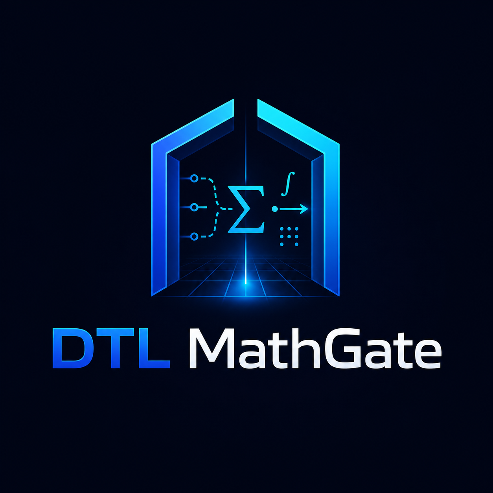

<p align="center"></p>

# DTL MathGate

[](https://github.com/kyal102/dtl-mathgate/actions/workflows/ci.yml)   

**Exact arithmetic, sealed with a replayable certificate. The model can explain the answer; it cannot override the math.**

```bash
python -m mathgate "12 * (3 + 4)"
```
```text
12 * (3 + 4)
  -> 84  (exact_integer)
     sealed sha256:6335247b30de6f51...
```

No floats, no rounding, no "close enough". `2^64` comes back as a full 20-digit
exact integer, `1/3 + 1/6` comes back as the exact fraction `1/2`, `sqrt(8)`
stays symbolic as `2*sqrt(2)` instead of getting rounded to `2.8284271...`, and
`1 + + * 2 )(` comes back `REFUSED` with a reason instead of a guessed answer.

## Install / run

No dependencies — pure Python standard library.

```bash
python -m mathgate "12 * (3 + 4)"
python -m mathgate "2^64"
python -m mathgate --demo
python -m mathgate --json "sqrt(8)"
python -m mathgate --bench       # ProofBench-X Lite: 240 seeded, oracle-graded cases
```

## Why a certificate

Every result — success or refusal — is sealed with a `sha256` hash over the
normalized query, status, and result. Run the same query twice, get the same
hash. That's the whole trust model in one line: **the certificate doesn't ask
you to believe the answer, it lets you replay the check.**

## What's here vs. what's proprietary

This repo is a **separate, independent implementation** covering exact
integer/rational arithmetic, symbolic square roots, integer powers, and
factorial — hand-written recursive-descent parser, graded by an independently
implemented `ast`-based oracle (`mathgate/proofbench_lite.py`), 240 seeded
cases, 0 failures, 0 certificate drift, reproducible by anyone.

The **hosted SuperMath Lab** (symbolic calculus, linear algebra, proof mode,
and the full 1,116-case ProofBench X corpus) is proprietary and lives at
[jvi3.com/packages#tab-supermath](https://jvi3.com/packages#tab-supermath),
with a live scoreboard you can watch update from a real run. See
[LICENSING.md](LICENSING.md).

→ **[Examples](docs/EXAMPLES.md)** · **[Limitations](docs/LIMITATIONS.md)** · **[5 bugs a benchmark caught](docs/BUGS_FOUND.md)**

## Reproduce it yourself

```bash
git clone https://github.com/kyal102/dtl-mathgate.git
cd dtl-mathgate
python -m unittest discover -s tests
python -m mathgate --bench --json
```

That last command is the falsifiable version of "trust us" — run it, and
compare the output to what's claimed above and on the hosted scoreboard.

## License

MIT for this lite engine ([LICENSE](LICENSE)). The hosted engine and its full
corpus are proprietary — see [LICENSING.md](LICENSING.md).
